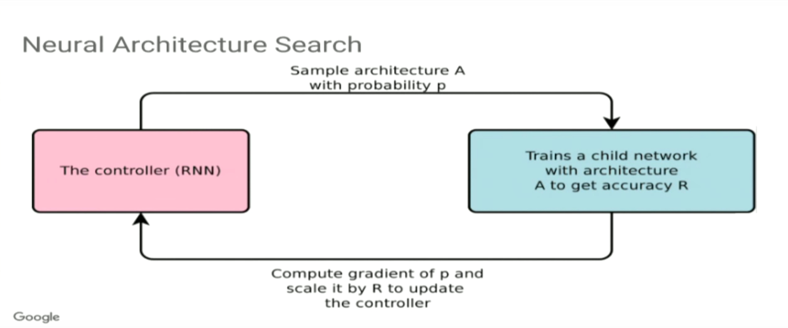
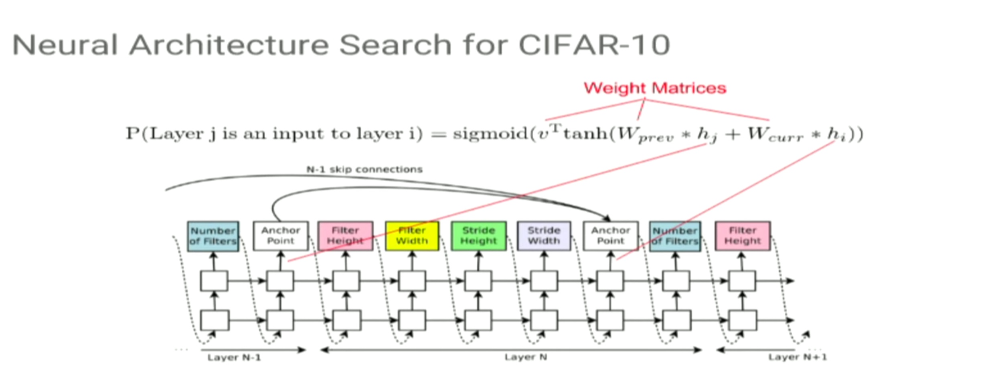
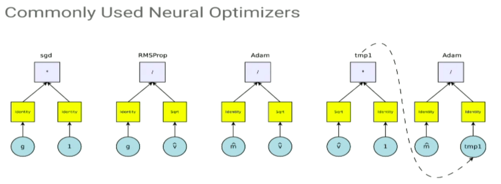
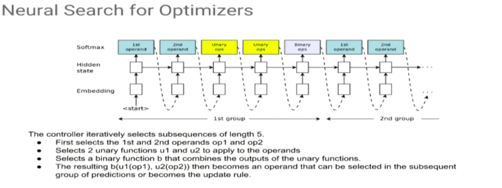
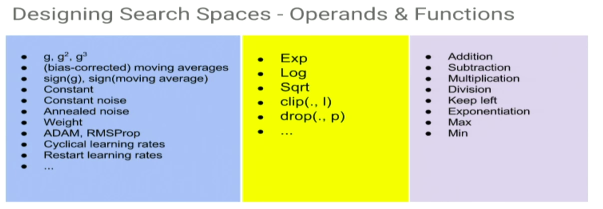

Paper: [ArXiv Link](https://arxiv.org/abs/1611.01578)

### Motivation

* Designing NN architectures is hard
* Tuning them is harder
* Not a lot of intuition to how to design
* Can we learn new architectures automatically?

### Key Idea
- Use RNN to output strings that defined the network
  - This is called `Controller` in the paper
- This string is then used to train a model and error on validation is treated as (negative) reward.
  - called `Child` network in the paper
- The RNN is trained using this reward using policy gradient/REINFORCE.

### Experiments
- Penn Treebank for RNNs
- CIFAR-10 for convolutional netwworks
  - allows for skip connection

### Results
- Cell found on Penn Treebank also worked for other datasets.
- Better results than Baysian Optimization (BO).
- More flexible than BO.

### Shortcomings

- Biased towards searches of models of particular kind. 
- Perhaps representing using string that represent arbitrary graph could be better.
- The goals was just to test this methodology, more work needs to be done.

### Similar
- Evolution ( Real et al, 2017)(5.4%)
- Q-learning (Baker et al, 2017)(6.92%)

## Neural Optimizer Search

