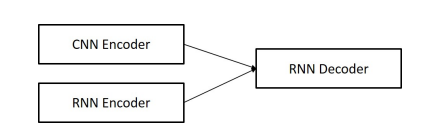
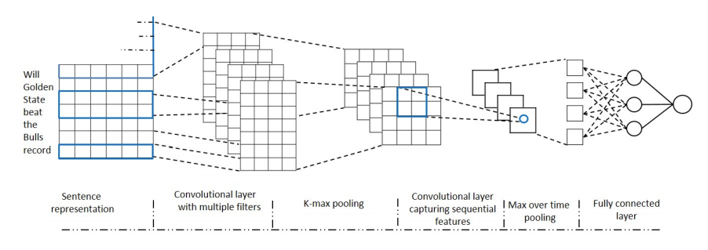
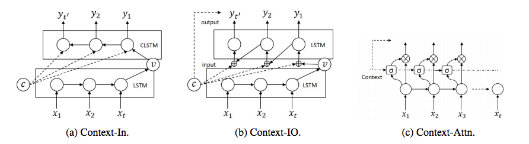

- Improvements over Seq2Seq to improve diversity of responses.
- Uses additional memory mechanism
- Challenges with conventional systems
   - Context sensitivity
   - scalablity
   - robustness

- Literature Review
   - Seq2seq used for English to French translation (2014)
   - Attention Mechanism on bi-RNN (2015) produced SOA on translation
   - Same seq2seq on movie dialogues (2015) produces generic replies like "of course"
   - Recent works suggest improvement by 
       - encoding previous utterance as additional inputs
       - optimize mutual information instead of cross entropy
       
- Model
   - Adds a CNN contextual encoder (CE). 
   - 
   
- CNN Contextual Encoder

   - CNN based on sentence classifier
   - dynamic k-max pooling (details [here](https://arxiv.org/pdf/1404.2188.pdf))
   - width of first later filters are same as embedding size.
   - height are set 1 to 4 ( 99% chinese words are under 4 chars)
   - Instead of producing classification, model generates fixed suzed vector representing distibution in the topic space.
   - Tried 3 different versions
   - 
   - __Context-In Model__
   - __Context-IO model__
   - __Context-Attention model__
   
- Training 
   - Train on cQA dataset (community question answers with topic info given). Questions are also used as contexts.
   - Same network is subsequently trained on conversation dataset with previous utterances as context.

